# MegaLinks

Megalinks is an android app where we provide free resources available for video editing, like Scenepacks, project files of the big editor, tutorials, etc..

<a href="https://play.google.com/store/apps/details?id=com.vk.MegaLinks" target="_blank">
        &nbsp; 
    </a>

## Features

- Smoothe UI Experience
- Search scene packs by Actor name
- Find Movie scene pack, Anime scenes, Project files and preset packs
- Request for packs
- Upload your material

## App UI

    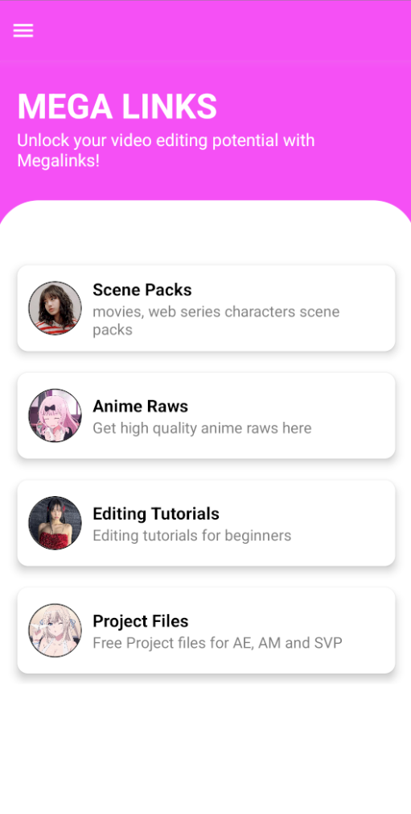
    
    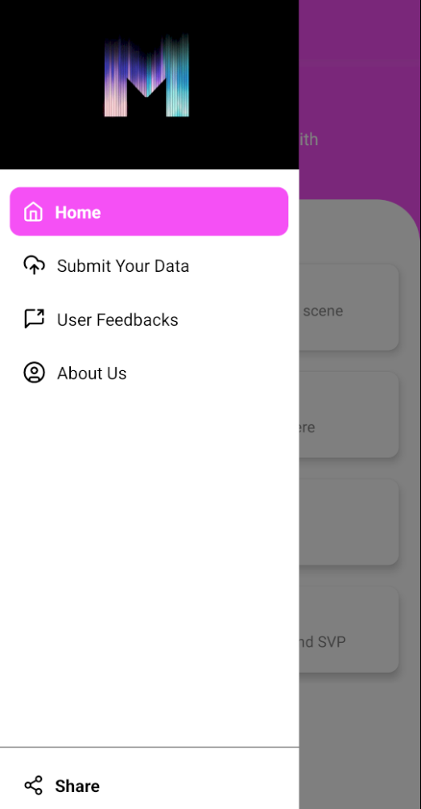
    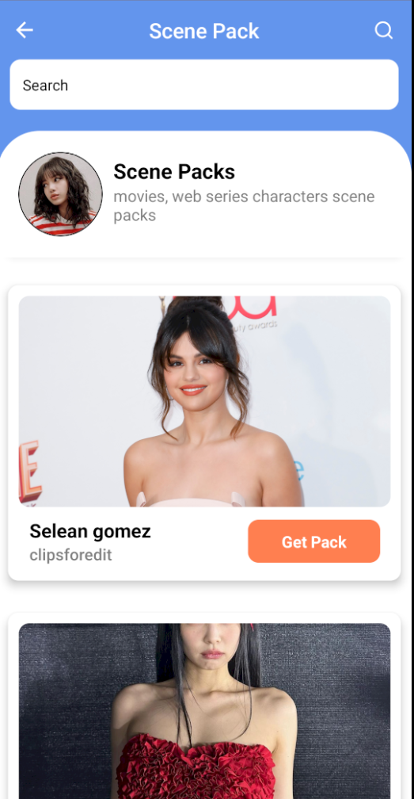
    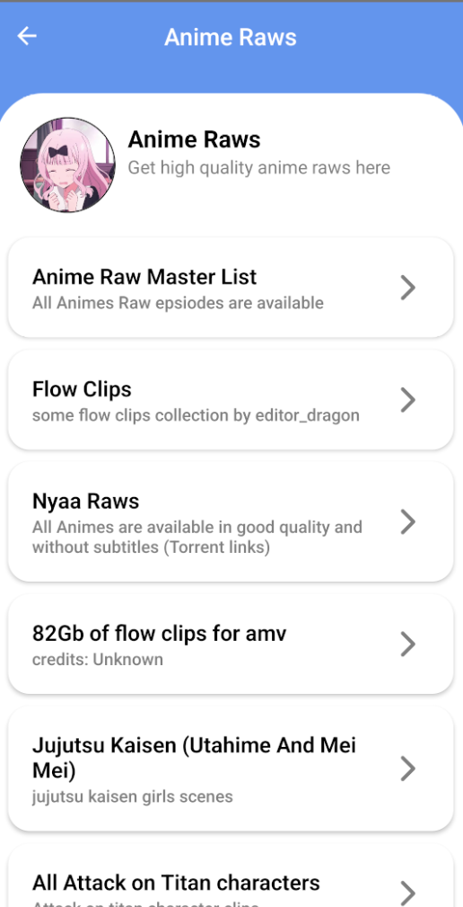
    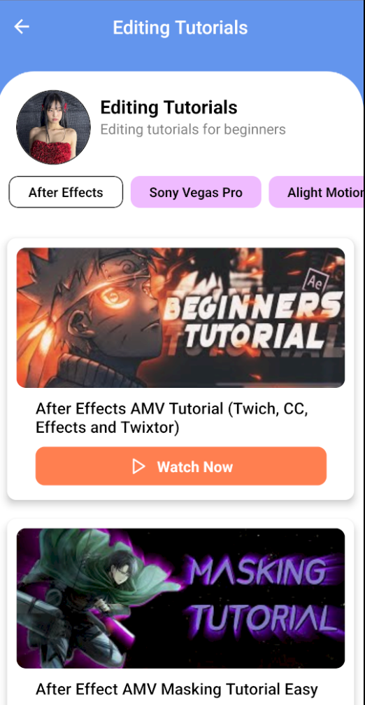
    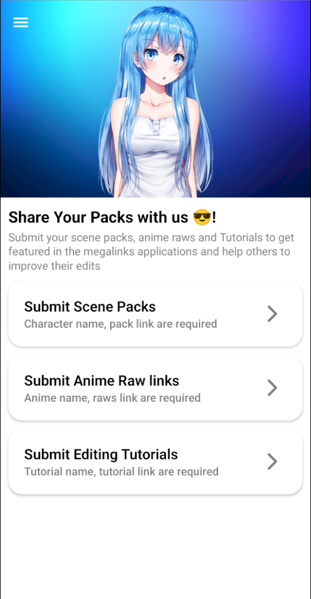
    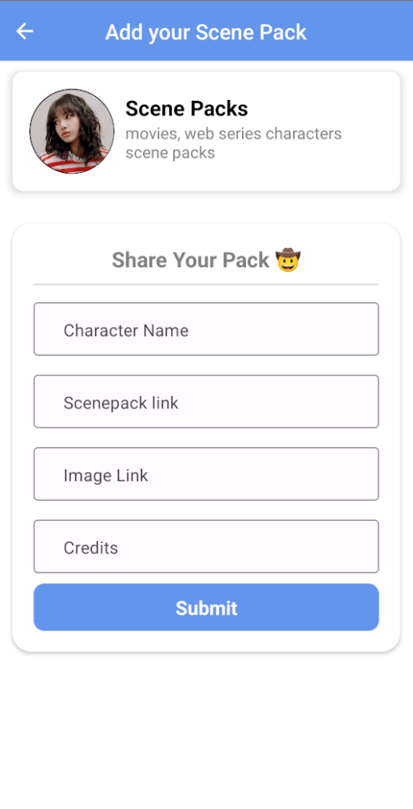
    
    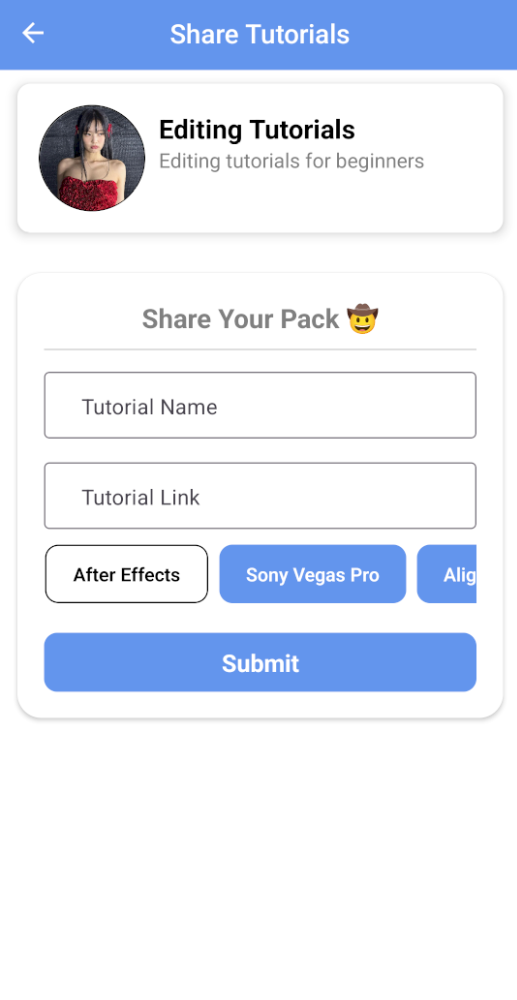
    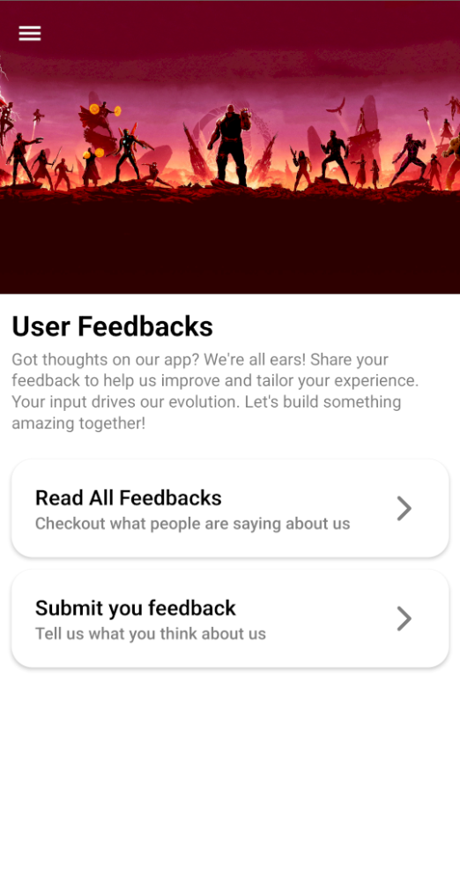
    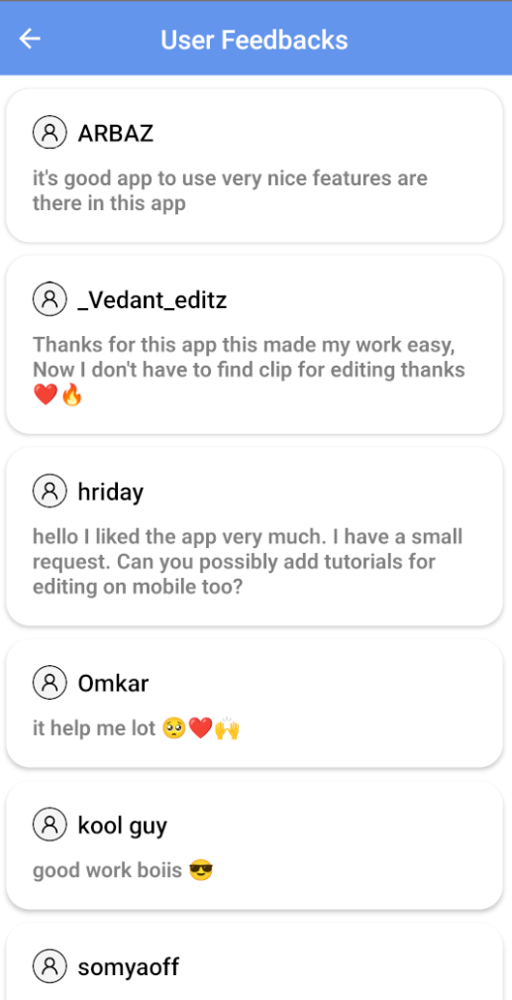
    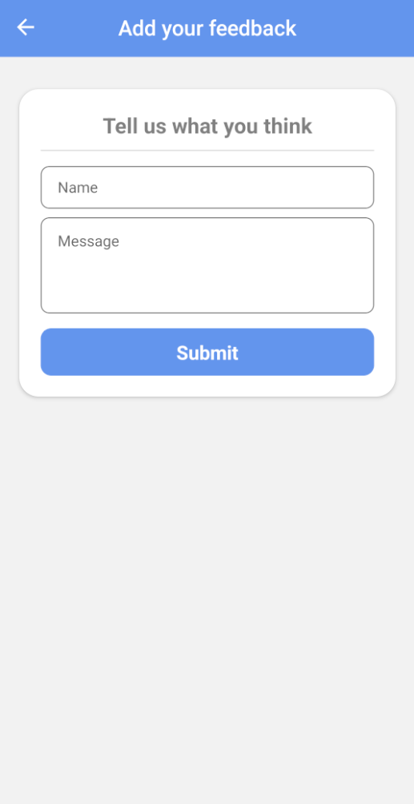
    

